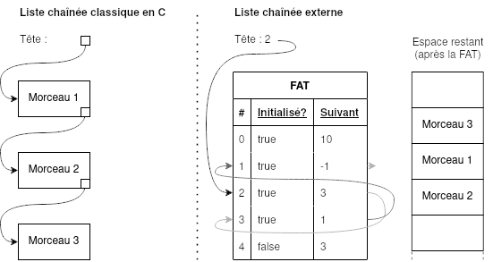
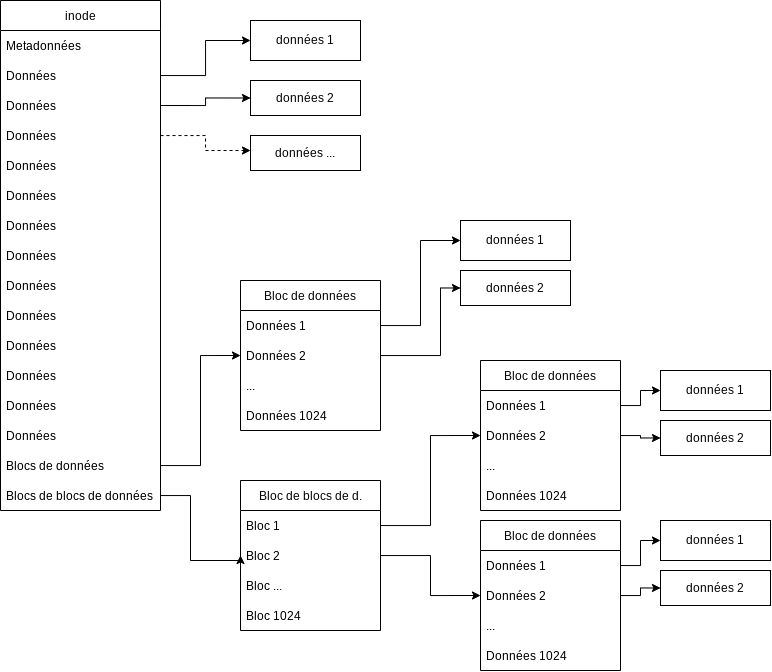

+++
title = "Systèmes de fichiers"
weight = 1

[extras]
illus = "https://images.unsplash.com/photo-1589995186011-a7b485edc4bf"
+++

Les périphériques de stockage de masse -- disques durs, clés USB, SSD, CD-ROM, disquettes, bandes magnétiques... -- reposent tous sur des technologies très différentes. Ce qu'ils ont tous de commun, par contre, c'est la forme sous laquelle ils présentent les données stockées : une liste d'octets <abbr title="On peut accéder à un octet étant donné son adresse, c.-à-d. sa position ordinale. À titre de comparaison, la mémoire vive est également adressables, d'où le concept de pointeur que tu as bouffé pendant plusieurs semestres.">adressables</abbr>, en lecture comme en écriture.

> En pratique, il ne s'agit pas _exactement_ d'une liste d'octets. Les octets sont souvent regroupés par paquets de 512 ou 4096 appelés "blocs", et l'ordinateur demande tout un bloc d'un coup.

À cette échelle, les notions de fichiers, répertoires, etc. n'existent pas. Un périphérique de stockage de masse, fondamentalement, à ce niveau-là, n'est vraiment rien de plus qu'une liste d'octets.

Pour un ordinateur tel qu'on les imagine aujourd'hui, cela n'est pas pratique du tout :
* Comment les programmes font-ils pour se mettre d'accord sur où écrire sans se marcher sur les pieds ?
* Comment le système d'exploitation sait-il quels utilisateurs et quels programmes ont le droit d'accéder à quels octets ?
* Comment fait-on si un programme épuise la "zone" de stockage qui lui était allouée ?

Une solution qui semble être la norme depuis bien longtemps : les systèmes de fichiers. Toutes les données sont stockées dans des "fichiers", qui se trouvent au sein d'un arbre de répertoires. Ces fichiers et ces répertoires ont des métadonnées associées qui permettent de leur attribuer des permissions, de connaître leur taille, leur date d'accès, leur propriétaire... Ces systèmes de fichiers sont des _abstractions_ sur la liste d'octet que présente le périphérique de stockage. C'est-à-dire qu'une spécification indique précisément comment doivent être structurés les données stockées pour qu'elles puissent être interprétées comme un système de fichier.

## Différences

Il existe de très nombreux formats de systèmes de fichiers (FAT, EXT4, NTFS, Btrfs...). Loins d'exister juste pour nous embêter, ils ont chacun leurs spécificités.

### Optimisation pour une certaine technologie de stockage

Les différentes technologies de stockage existantes ne garantissent pas toujours les mêmes performances dans les mêmes cas d'usage.

Les disques durs — au sens strict (pas les SSD) — sont plutôt performant lors d'accès séquentiel aux données, c.-à-d. qu'ils offrent des performances optimales lorsque des octets sont lus dans l'ordre. À l'inverse, une tentative d'accès aléatoire aux octets du disque risque d'être très lente. La raison est simple : un disque dur est un objet mécanique équipé de moteurs, d'aimants et de parties en mouvements. Lors d'un accès à un octet éloigné d'un précédent, le contrôleur du disque doit physiquement provoquer le déplacement de plusieurs pièces, ce qui prend du temps.

Les SSD, clés USB, cartes SD et autres mémoires flash sont des puces électroniques. Les technologies exactes ne sont pas les mêmes, et la rapidité et la durée de vie d'un SSD n'a rien à envier aux deux autres, mais la théorie reste semblable : il n'y a pas de pièces en mouvement, ce qui rend l'accès aléatoire tout aussi rapide que l'accès séquentiel. Ces technologies ont par contre l'inconvénient d'être limitées nombre d'écritures de chaque bloc pour des raisons techniques. Les SSD sont particulièrement bons pour limiter ce problème en essayant d'étaler les écritures sur des blocs différents au fil du temps, mais les clés USB ou les cartes SD n'ont pas forcément cette capacité.

### Support de métadonnées différentes

Une différence très bête entre deux systèmes de fichiers sont les métadonnées supportées. En plus du contenu d'un fichier, il convient généralement de lui associer des dates de création/modification/accès, des permissions, un propriétaire, mais également éventuellement des _flags_ (caché?, compressé?, lecture seule?).

Selon les usages, on peut trouver certaines de ces métadonnées superflues ou non. De plus, certains _flags_ peuvent n'avoir de sens que sur un système d'exploitation en particulier. Ou bien, le système de permissions et de propriétaire peut être radicalement différent entre deux OS. Unix gère les droits d'accès en stockant 12 bits de permission^[https://fr.wikipedia.org/wiki/Chmod] et l'identifiant numérique du propriétaire. Cela n'a rien à voir avec Windows, et doit être supporté plus ou moins au cas par cas par le système de fichiers lui-même.

Enfin, les systèmes de fichiers ont aussi besoin de pouvoir faire la distinction entre un fichier et un répertoire. Mais ça ne s'arrête pas là ; par exemple, EXT4 et NTFS supportent également des _liens symboliques_, qui ne sont ni des fichiers, ni des répertoires. Et on peut ainsi imaginer divers types de "fichiers" bizarres qui auraient du sens sur un système de fichier, mais pas sur un autre.

### Résilience à la corruption en cas d'arrêt brutal d'une machine

Si tu as un ordinateur de bureau, il est possible que tu ais déjà fait l'expérience d'une coupure de courant qui te fait perdre une quantité plus ou moins importante de travail. Heureusement, ton ordinateur a redémarré sans soucis et tout le reste de tes fichiers sont intacts.

Créer des systèmes résistant à un arrêt brutal n'est pas une tâche facile. Mais les systèmes de fichiers sont tellement au centre de tout ce que nous faisons avec nos ordinateurs qu'il aura bien fallu que quelqu'un s'y affaire. Aujourd'hui, les principaux systèmes de fichiers sont capables de récupérer d'une coupure de courant, on les qualifie de systèmes de fichiers _journalisés_. Évidemment, si des données n'ont pas été écrites sur le disque avant la coupure, il est impossible de les y retrouver, mais au moins la structure interne du système de fichiers n'est pas corrompue.

Plus d'informations ci-dessous, dans [§EXT](#ext).

## Trois exemples

### FAT (File Allocation Table)

Ce format, imaginé par Microsoft, est celui que nous avons utilisé à la tâche 5 de `object.classes`. Celui-ci est inspiré du fonctionnement d'une liste chaînée, à la différence que le pointeur vers le "nœud" suivant ne se trouve pas à l'intérieur du nœud précédent, mais dans un tableau séparé — la fameuse _table d'allocations de fichiers_ — qui réside au début de la zone de stockage du périphérique.

Étant donné un n° de bloc de départ d'un fichier, on peut se référer à la FAT, en suivant les nœuds, pour savoir quels sont les blocs suivants. Un "-1" indique la fin du fichier. Si la taille d'un fichier n'est pas un multiple de la taille d'un bloc, il se peut que quelques octets du dernier bloc de ce fichier ne soient pas utilisés. Ce n'est pas un problème, car la taille réelle du fichier est stockée dans des métadonnées autre part, et on peut donc simplement ignorer les octets en trop.

Notons aussi que les répertoires sont stockés comme des fichiers, sauf qu'une métadonnée indique qu'il s'agit d'un répertoire. Un répertoire est stocké comme s'il s'agissait d'un fichier, mais avec un format très précis : un tableau à 3 colonnes: `nom`, `bloc de début`, `métadonnées`.

Maintenant, on peut se demander comment accéder à un fichier ou à un répertoire spécifique en connaissant son nom. En fait, le fichier dont le bloc initial est le bloc "0" est immédiatement considéré comme étant un répertoire, en particulier la racine. Pour accéder à un fichier `/etc/hosts` par exemple :

* Il faut d'abord parcourir le répertoire d'indice 0 en parcourant la liste chaînée à partir de 0, et chercher une entrée dont la colonne `nom` vaut "etc". On trouve alors un numéro de bloc de début, par exemple 130, et des métadonnées
* On vérifie grâce aux métadonnées que l'entrée "etc" trouvée est bien un répertoire
* On recommence, en partant cette fois ci de 130, on parcourt la liste chaînée jusqu'à trouver une entrée "hosts", dont on connait maintenant le bloc de départ, par exemple 113, et les métadonnées
* On vérifie grâce aux métadonnées que l'entrée "hosts" trouvée est bien un fichier
* Grâce aux métadonnées, on récupère la longueur du fichier
* On parcourt la liste en partant du bloc 113; il s'agit du contenu de notre fichier. Lorsque le nombre d'octets lus est égal à la longueur, on s'arrête, le reste n'a plus de sens.

Inconvénients :
* Fragmentation interne : si la taille d'un fichier n'est pas un multiple de la taille d'un bloc, certains octets du dernier bloc seront inutilisés et occuperont de la place "pour rien"
* Inefficacité pour de l'accès aléatoire aux fichiers. Comme c'est le cas des listes chaînées en C, l'accès au milieu d'un fichier — par exemple — se fait en O(n). Ce n'est pas dramatique, car la FAT est souvent copiée dans la mémoire vive et donc accessible rapidement, mais ça reste sous-optimal.

Avantages du FAT :
* Pas de fragmentation externe : le contenu des fichiers n'a pas besoin d'être stocké en un seul morceau, donc même des petits trous entre deux zones occupés peuvent être utilisés pour stocker une partie d'un gros fichier.
* De façon générale, ce système est adapté pour les clés USB et les cartes SD, des périphériques couramment employés pour copier et déplacer des données, ce qui ne requiert que des accès séquentiels dans tous les cas.

### Ext

Le système de fichiers EXT, très couramment utilisé sur Linux, utilise un système basé sur des _inodes_. Un _inode_ est une structure de taille constante, stockée quelque part sur le périphérique, qui possède des métadonnées suivies de 12 pointeurs vers des blocs de données, puis d'un pointeur vers un bloc, qui lui-même contient des pointeurs vers des blocs de données, et enfin d'un pointeur vers un bloc, de bloc, de pointeurs vers des données. Pfiou... Le schéma parlera de lui-même :

De façon similaire au FAT, les répertoires sont de simples fichiers avec une métadonnée spéciale, et dont le contenu pointe vers des inodes.

L'avantage de cette méthode est qu'elle est très performante pour de l'accès aléatoire ; il est en effet possible d'accéder à n'importe quel bloc en 2 indirections maximum, alors que le FAT peut très vite grimper en nombre d'indirections. De plus, il est possible de calculer rapidement le chemin à prendre pour accéder à un bloc donné, étant donné l'indice d'un octet du fichier auquel nous voulons accéder.

L'Ext3 introduit, par rapport à son prédécesseur, un système de journal. Lorsque des modifications sont apportées à un fichier ou à l'arborescence, l'action en question est écrite dans ce journal et la modification n'est pas faite immédiatement. Lorsque toute l'entrée du journal a été écrite, une somme de contrôle est apposée pour indiquer que la modification peut être effectuée "en dur". Elle sera appliquée plus tard, en parallèle. Ainsi, si une coupure de courant a lieu, le système verra au moment du redémarrage qu'une entrée valide se trouve dans le journal et doit donc être appliquée.

### Les LFS (Log-structured File System^[https://en.wikipedia.org/wiki/Log-structured_file_system])

Il existe une version extrême de la journalisation : des systèmes de fichiers qui reposent exclusivement sur le journal, où les entrées du journal n'ont pas pour but d'être copiées autre part. Concrètement, le journal est l'unique structure depuis laquelle les données seront lues.

Lorsqu'une modification, quelle qu'elle soit (suppression, ajout, renommage, agrandissement d'un fichier...), est effectuée, une entrée est ajoutée au journal, avec la modification en question stockée dedans. Si l'on souhaite lire des informations sur le système de fichiers (lire un fichier, énumérer le contenu d'un dossier ou bien lire des métadonnées), il suffit de remonter le journal à l'envers jusqu'à trouver l'information qui nous intéresse.

Le journal est une mémoire en anneau, c'est-à-dire qu'une fois plein, on revient au début en écrasant les données qui n'ont plus d'intérêt à exister (car une modification ultérieure les redéfinit).

Ce système est particulièrement résistant aux arrêts brutaux pour les mêmes raisons que l'Ext. Il permet également d'avoir accès à un historique de modifications des fichiers, du moins avant que le curseur d'écriture ait fait le tour et commence à effacer les vielles entrées. Son principal inconvénient est qu'au fil du temps et des tours complets effectués par le journal, une fragmentation peut apparaître, et le rendre lent à utiliser sur des moyens de stockage qui ne sont pas adaptés à l'accès aléatoire.