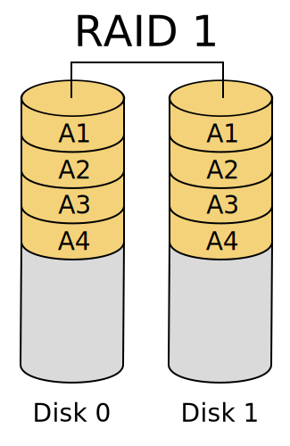

+++
title = "RAID"
weight = 3
+++

Dans certains cas, le contenu d'un disque peut être réalité être réparti sur plusieurs disques : c'est ce qu'on appelle le RAID (Redundant Array of Independant Disks).

Répartir ainsi les données permet un accès plus rapide : on peut demander un premier bloc au premier disque, et au lieu d'attendre qu'il ait fini pour demander le suivant, on peut en même temps le demander à un autre disque.

Si un disque tombe en panne, les autres peuvent servir de sauvegarde, à condition que le RAID ait été configuré pour ça.

Il existe trois types de RAID très utilisés :

- RAID 0 : on répartit les données sur plusieurs disques, mais sans les dupliquer. On gagne en vitesse mais on a aucune sécurité si un disque cesse de fonctionner.

- RAID 1 : on duplique les données sur plusieurs disques. On ne gagne pas en performances mais on a une sauvegarde si un disque rend l'âme.

- RAID 5 : on répartit les données sur plusieurs disques comme en RAID 0, mais on ajoute un disque qui contient des blocs « de parité » à partir desquels on peut re-calculer le contenu d'un bloc manquant si jamais un disque est défectueux. On gagne donc en performance et en fiabilité.

- RAID 0+1 : Il permet d'obtenir du mirroring rapide puisqu'il est basé sur des grappes (RAID 0) combinées en miroir (RAID 1).
  

Voir en détail sur [Wikipedia](https://fr.wikipedia.org/wiki/RAID_(informatique))