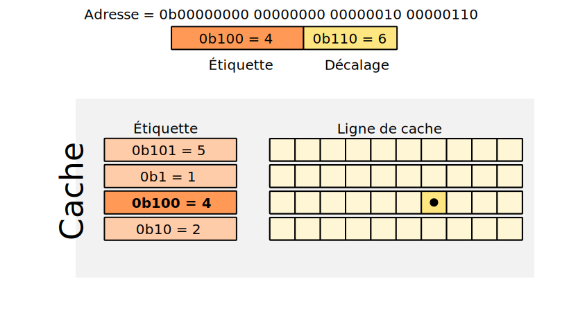
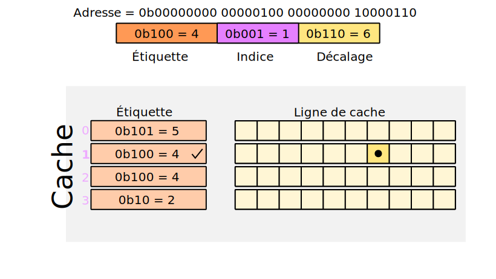
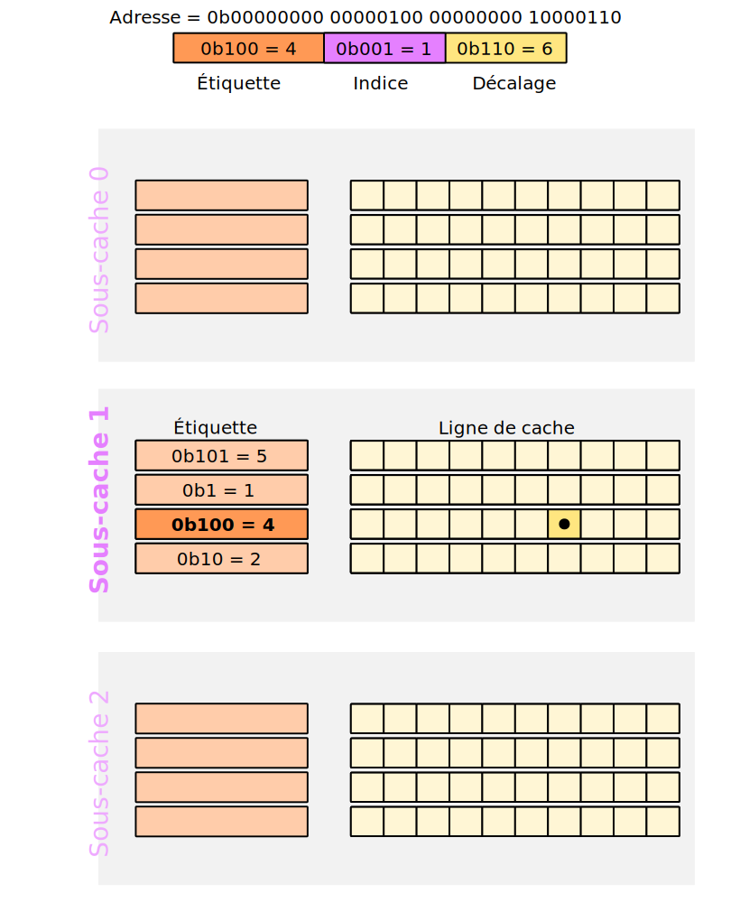

+++
title = "Caches"
weight = 4

[extra]
illus = "illus.avif"
+++

Les accès à la mémoire peuvent prendre un peu de temps (à l'échelle d'un processeur, ça reste
des temps très courts pour des humains). Pour éviter que les performances soient trop
mauvaises quand un programme accède à la mémoire, les processeurs ont un mécanisme de cache.
Ce sont des petites mémoires qui retiennent les valeurs accédées récemment, et qui sont plus
rapide d'accès que la vraie mémoire.

Dans la plupart des processeurs, on a trois niveaux de cache : L1, L2 et L3 (du plus petit et
rapide aux plus gros et plus lent).

## Organisation d'un cache

Lors d'une lecteur ou d'une écriture d'une donnée qui n'est pas encore dans le cache,
elle y est ajoutée. Mais même si cet donnée ne fait qu'un ou deux octets, le cache
stocke 128 octets[^taille-ligne], dans ce qu'on appelle une ligne de cache. Ainsi, si on accède à l'octet
à l'adresse `x`, les octets entre les adresses `x` et `x+128` seront mis en cache, et si on demande
l'accès à l'adresse `x+1` juste après, sa valeur sera déjà dans le cache. Ça tombe bien parce
que demander des adresses qui se suivent est ce qu'on fait quand on parcours un tableau par exemple.

Quand une donnée est mise en cache, il faut la mettre à un endroit précis pour pouvoir la retrouver
plus tard. Comme les caches sont plus petits, on ne peut pas dire que la donnée qui est à l'adresse `x` dans
la mémoire principale va aussi à l'adresse `x` dans le cache, ça ne rentre pas.
Pour choisir l'endroit où on va mettre la donnée en cache, il existe trois façons de faire.

### Cache associatif

Avec ce type de cache, chaque ligne a une « étiquette associée » (qui est une suite de bits).
Pour savoir dans quelle ligne une adresse `a` doit être stockée, on prend son étiquette `a / T`, où `T` est une
constante choisie en avance. En général, on prend une puissance de 2, comme ça on peut juste garder
un certains nombre de bits de poids fort.

Si une ligne de cache fait 128 octets, on utilise les 7 bits de poids faible pour savoir quel octet prendre
dans la ligne (27 = 128). Les 25 bits de poids forts correspondent à l'étiquette de la ligne.

Pour retrouver une donnée, on cherche la ligne qui a l'étiquette associée correspondant à son adresse.

### Cache direct

Pour savoir où mettre une donnée dans ce type de cache, il faut décomposer son adresse en trois parties :

- un indice, qui dit à quelle ligne dans le cache on doit stocker la donnée ;
- une étiquette, qui sert à éviter les conflits ;
- un décalage, qui indique où dans la ligne de cache se trouve la donnée.

Si on prend l'exemple de l'adresse `0b10000000 10000000 00000010 01111111`, et qu'on dit que
l'étiquette va des bits 32 à 17, que l'indice va des bits 16 à 8 et que le décalage va des bits
7 à 1, on obtient :

- indice = `00000010 0` = 4 ;
- étiquette = `10000000 10000000` ;
- décalage = `1111111`.

Il faudra donc mettre cette donnée dans la 4ème ligne du cache. Cette technique permet
de déterminer bien plus rapidement quelle ligne choisir qu'un cache associatif, où on doit comparer
toutes les étiquettes avant de trouver la bonne.

Là où l'étiquette devient utile, c'est lorsqu'on se rend compte que plusieurs adresse totalement
différentes peuvent vouloir utiliser la même ligne de cache. Par exemple `0b11111111 11111111 00000010 01100110`
a le même indice que l'adresse précédente, alors que ce ne sont pas les mêmes du tout.
Avant d'accéder à la ligne, on va vérifier que son étiquette correspond à celle de l'adresse,
et si ce n'est pas le cas, on ira chercher la vraie donnée dans la mémoire principale.
C'est le désavantage de cette méthode : on a souvent des collisions et donc on va souvent
mettre à jour le cache, perdant donc en performance.

### Cache associatif par ensemble

Cette solution est un compromis entre les deux précédentes, essayant d'être aussi simple qu'un cache direct
et aussi efficace qu'un cache associatif.

Elle consiste à diviser le cache en ensembles de sous-caches. Chaque sous-cache fonctionne comme un
cache associatif.

Pour savoir où placer une adresse, on la divise de la même façon que pour un cache direct. L'indice
ne va pas indiquer à quelle ligne dans le cache on doit aller, mais dans quel sous-cache se placer.
Ensuite, on utilise l'étiquette pour trouver la bonne ligne de cache.

(Ça marche un peu comme les buckets de `object.collections` en POO…)

## Nettoyage du cache

Dans le cas d'un cache associatif ou d'un cache associatif par ensemble, il se peut qu'on veuille
ajouter une nouvelle ligne dans le cache, et il faut alors décider où (avec un cache direct, la ligne
est fixée pour une adresse, on a pas le choix de où la placer). Si il reste de la place dans le cache,
il suffit de prendre la première ligne de libre qu'on trouve. Mais si toutes sont déjà prise, il faut
décider laquelle remplacer. Il y a différents algorithmes pour ça :

- l'aléatoire : on choisi une ligne au hasard ;
- le LRU (least recently used) : on se souviens de la dernière fois qu'une ligne a été lue ou écrite, et on supprime la plus ancienne
  quand on a besoin de faire de la place ;
- le pseudo-LRU : même idée que le LRU, mais on s'autorise des approximations pour gagner en performances ([cet article Wikipédia en anglais](https://en.wikipedia.org/wiki/Pseudo-LRU) explique deux algorithmes pseudo-LRU qui peuvent être utilisés).

## Algorithme d'écriture

Lors d'une écriture, la donnée en cache est mise à jour. Mais il faut aussi mettre à jour la mémoire principale.
Là aussi, il y a plusieurs façons de faire.

Si on fait du **write through**, l'écriture dans la mémoire principale est immédiate.

Mais si on veut être plus intelligent et éviter d'accéder trop souvent à la mémoire principale, on peut faire du **write back**.
On va ajouter à chaque ligne un bit *Dirty* qui indique si la ligne a été modifiée. Quand on écrit
dans une ligne, on met *Dirty* à 1. Au moment où on veut supprimer cette ligne (pour la remplacer par une autre),
on va l'écrire dans la mémoire seulement si *Dirty* vaut 1. On fait donc une seule écriture dans la mémoire
principale même si on a eu plusieurs écritures dans le cache, et si il n'y a pas eu d'écriture du tout,
on ne va pas recopier la ligne de cache dans la mémoire non plus.

[^taille-ligne]: Ce nombre peut varier selon les processeurs.