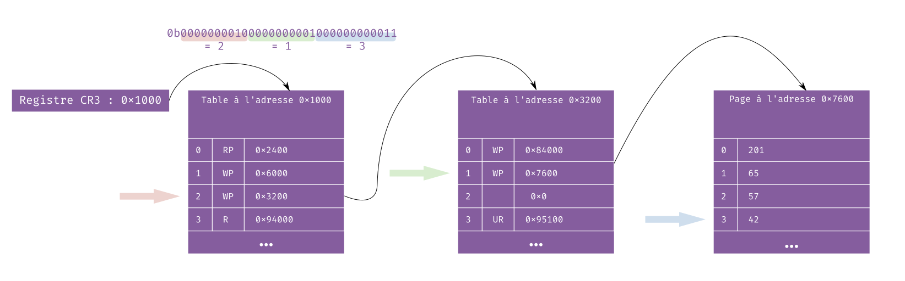

+++
title = "Pagination"
weight = 3
+++

Le système de protection de la mémoire qui est le plus utilisé aujourd'hui est la **pagination**.

## Tables de pages

La pagination repose sur un système de page. Une page est une petite zone de mémoire (4Kio en général).

En plus de ça, on a des tables de pages.
Ces tables sont des structures de données stockées dans la mémoire, que le système
d'exploitation écrit afin de définir les règles d'accès à la mémoire pour chaque processus.
Ce sont des grands tableaux (de 512 éléments en général), dont chaque élément correspond à
une l'adresse d'une page ainsi que quelques informations supplémentaires qu'on appelle drapeaux.
Les plus communs et importants sont :

- `Present` (P) qui vaut 1 si la page existe bien, et 0 si elle n'a pas été initialisée ;
- `Read-Only` (R) ou `Write` (W) selon si la page est en lecture seule, ou si on peut écrire dessus ;
- `User` (U) qui indique si les processus utilisateurs peuvent accéder à cette page ou non.

Les tables de pages peuvent pointer vers des pages, mais aussi vers d'autres tables de pages.
Selon les systèmes on aura différents niveau d'imbrication des tables de pages.
En SPC, les systèmes qu'on prend en exemple n'en ont souvent que deux : on va voir une première
table de pages, dans laquelle on trouve l'adresse d'une seconde table de pages, et parmi tous les éléments
de cette table de pages, on a la page qui nous intéresse vraiment.

Pour trouver l'adresse à laquelle se trouve la première table, on lit le registre CR3.
Le système d'exploitation peut donc mettre en place les pages pour chaque processus, et
quand on veut passer d'un processus à l'autre, il suffit de changer la valeur de CR3[^ring0].

## Traduction d'adresse

Il nous manque un élément pour décoder une adresse virtuelle avec ce système : quel élément prendre
parmi les 512 que contient une table de pages ?

La réponse est dans l'adresse qu'on veut traduire : il faut la séparer en plusieurs morceaux.
La façon dont on fait cette décomposition va dépendre de la taille des adresses et du processeur
sur lequel on est, mais dans le cas d'une adresse sur 32 bits, on peut décomposer en 10 bits, encore
10 bits, et 12 bits.

Les 10 premiers bits donnent l'indice dans la première table de page, les 10 suivants dans la seconde,
et les 12 derniers sont le décalage dans la page.

## Exercice

Si tu veux t'entraîner un peu et vérifier que tu as bien compris, voici un petit exercice interactif
où tu incarnes un processeur qui veut décoder une adresse.

<iframe src="/exercises/manual-pagination/"></iframe>

[^ring0]: Changer la valeur de CR3 est une opération que seul le noyau peut effectuer, bien-sûr. Sans ça les processus pourraient avoir accès aux tables de pages d'autres processus.