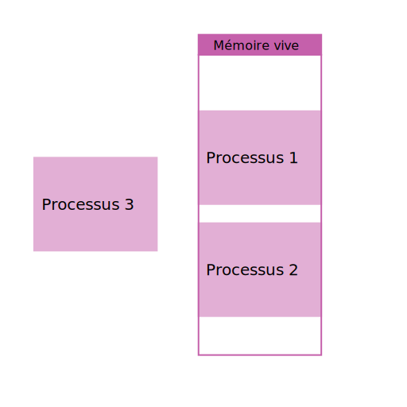
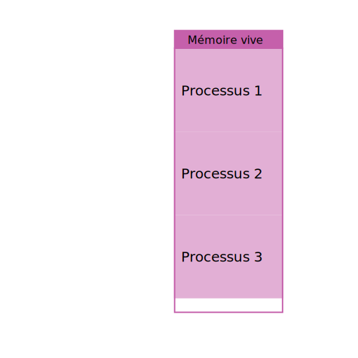
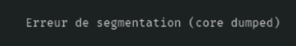

+++
title = "Segmentation"
weight = 2

[extra]
illus = 'illus.avif'
+++

Dans un système qui utilise la segmentation, les accès en mémoire se font à l'aide de
deux paramètres (au lieu de juste une adresse) :

- le sélecteur de segment, stocké dans un registre
- l'adresse dans le segment, stocké dans un registre ou écrit sous forme de constante dans le code

Chacun fait 16 bits, et pour obtenir l'adresse complète sur 32 bits, il suffit
de les concaténer.

Pour garantir la sécurité et l'isolation des processus avec ce mécanisme, seul le
noyau peut définir le sélecteur de segment. Le processus utilisateur ne peut choisir
que l'adresse dans le segment qu'on lui propose. Du point de vue du processus utilisateur,
l'instruction « lire la mémoire à cette adresse » n'a qu'un paramètre (qui est l'adresse dans le segment).

Par exemple, si le noyau décide que le sélecteur de segment pour le processus « Lecteur de musique »
sera `0xabcd`, alors ce processus pourra accéder aux adresses `0xabcd0000`, `0xabcd1234` ou encore
`0xabcdefff`. Mais il n'a aucun moyen d'accéder à l'adresse `0xabcc0000`, car la première moitié de
l'adresse est figée de son point de vue (si jamais il tente de le modifier, une interruption aura lieu pour informer
le noyau qu'un processus se met un peu trop à l'aise (et il se fera sans doute stopper de suite)).

## Les problèmes de la segmentation

Comme l'adresse dans le segment fait 16 bits, on peut désigner 216 = 65 536 adresses (soit 64Kio de données).
Cette taille fixée peut poser problème : comment faire si on a besoin de plus au bout d'un moment ?
Réponse : on ne peut pas vraiment. La seule solution qui a été trouvée a été d'introduire plusieurs sélecteurs
de segments, et de permettre au processus de choisir dans une liste celui qu'il veut utiliser. Au lieu d'un
seul segment, un programme peut donc en avoir 3 ou 4. Mais on ne peut pas créer une infinité de registre,
donc le nombre de segments disponibles reste très bas.

Un autre gros souci est la fragmentation. Le problème est vite visible sur ce schéma, où on a déjà
deux processus qui ont des segments réservés, et où on aimerait en lancer un troisième :

Où est ce qu'on met le segment de mémoire du nouveau processus ? On voit qu'il y aurait la place
de le mettre en mémoire si toutes les zones libres étaient côte à côte, mais ce n'est pas le cas.

Alors il va falloir les décaler (défragmenter) : pour chaque segment déjà en place, on recopie toute la mémoire à un
autre emplacement, ce qui est très long. Et pendant ce temps le système tout entier est en pause.

À cause de ces soucis, la segmentation n'est plus vraiment utilisée aujourd'hui. Une des seules trace qu'il en reste
est ce petit message…

